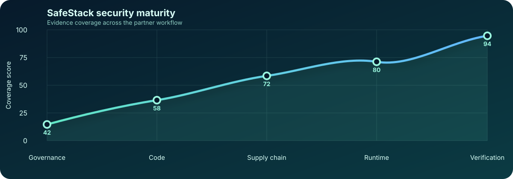
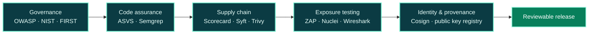
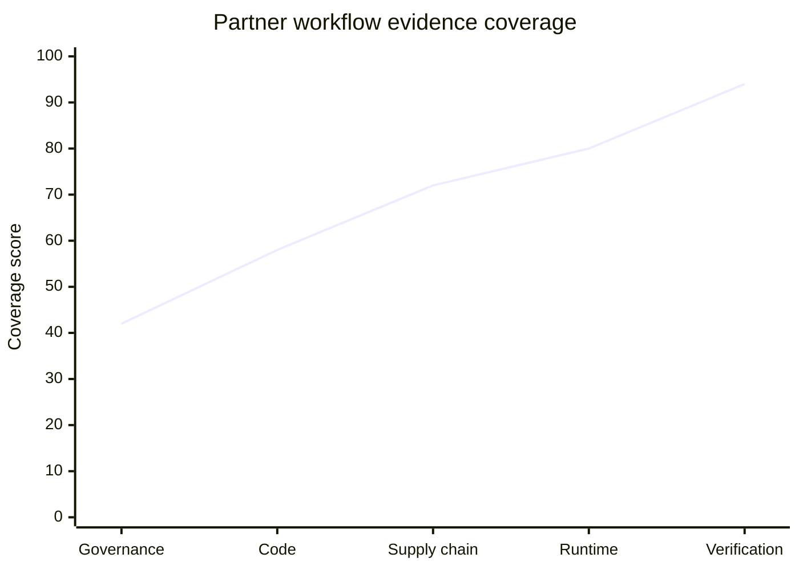

# SafeStack partners and ecosystem resources

  

  
  
  

This repository documents organizations and public resources that support SafeStack's security learning, threat intelligence, verification and open-source work.

> A listing here records an ecosystem relationship or useful external resource. It does not by itself claim a commercial endorsement, certification or signed partnership agreement.

## Security operating picture

The catalogue is organized as an evidence path: establish a baseline, inspect code and dependencies, identify secrets, scan the runtime surface, then sign and verify the resulting artifacts.

### X/Y coverage view

The chart below is a planning view of how evidence coverage grows as controls move from governance into verification. It is a management signal, not a claim that an external tool proves security by itself.

| **28+** | **10** | **5** | **1** |
| ---: | ---: | ---: | ---: |
| ecosystem resources | recommended GitHub projects | control stages | signed identity registry |

## Project governance

Read the [contribution guide](CONTRIBUTING.md), [security policy](SECURITY.md), [code of conduct](CODE_OF_CONDUCT.md) and [support guide](SUPPORT.md) before opening a change. GitHub issue forms and the pull request checklist help keep corrections evidence-based and free of secrets.

## License and intellectual property

The original documentation and artwork in this repository use the standard [CC BY-NC 4.0](LICENSE) license: people may share and adapt them for non-commercial purposes with attribution. SafeStack name and logo rules are kept separately in [TRADEMARKS.md](TRADEMARKS.md), because trademarks and third-party materials are not automatically covered by a content license.

## Partners and resources

| Organization | Resource | Purpose for SafeStack |
| --- | --- | --- |
| [SANS Institute — EMEA](https://www.sans.org/emea) | Cybersecurity training and GIAC certification preparation | Professional learning paths, hands-on training and incident-response, defensive, offensive and leadership capability development. |
| [TryHackMe](https://tryhackme.com/) | Interactive cybersecurity training | Practical, safe laboratories for building security skills, validating procedures and supporting continuous learning. |
| [Have I Been Pwned](https://haveibeenpwned.com/) | Breach exposure awareness | A public service for checking whether an email address appears in known data breaches and improving credential hygiene. |
| [MITRE ATT&CK](https://attack.mitre.org/) | Adversary tactics and techniques knowledge base | A common language for threat modeling, detection mapping, security research and coverage discussions. |
| [Codeberg](https://codeberg.org/) | Open-source Git hosting | An independent open-source collaboration and hosting option for public software and reproducible project work. |
| [Xcitium ThreatMap](https://threatmap.xcitium.com/) | Real-time malware threat map | An external situational-awareness signal for observing current malware activity and communicating the wider threat landscape. |
| [Exploit Database](https://www.exploit-db.com/) | Public exploit and proof-of-concept archive | A research reference for authorized penetration testing, vulnerability validation and defensive patch prioritization. Use only within an explicit scope and never against systems without permission. |
| [Kali Linux](https://www.kali.org/) | Penetration-testing platform | A documented operating environment and tool collection for authorized security assessments, labs and controlled research. |
| [BunsenLabs Linux](https://www.bunsenlabs.org/index.html) | Lightweight Debian-based desktop distribution | A low-resource, customizable Linux environment useful for dedicated research workstations and reproducible lab setups. |
| [HackerOne](https://www.hackerone.com/) | Vulnerability discovery and disclosure platform | A coordinated channel for security research, validation and responsible vulnerability reporting when a program's scope and rules permit it. |
| [PythonWorld](https://pythonworld.ru/) | Python learning reference | Beginner-friendly Python lessons and examples that support developer onboarding and automation fundamentals. |
| [OpenSSL Documentation](https://docs.openssl.org/master/) | Cryptographic and TLS documentation | Primary reference for OpenSSL commands, libraries, formats, FIPS material and TLS/QUIC implementation guidance. |
| [Generate-Random encryption keys](https://generate-random.org/encryption-keys) | Online key-generation utility | A convenient educational utility for test data and non-production experiments. Root, signing and production secrets must be generated locally or by a managed HSM; never paste them into a website. |
| [Udemy](https://www.udemy.com/) | Online learning platform | Supplementary courses for engineering, cloud, security and professional development. Course quality and currency must be reviewed before relying on material. |
| [MobaXterm](https://mobaxterm.mobatek.net/) | Windows SSH and terminal client | A practical administration tool for authorized remote operations, SSH sessions and controlled lab access. |
| [Agent Skills](https://agentskills.io/home) | Agent capability and skills resource | A reference point for understanding reusable agent skills and structuring safe, reviewable automation workflows. |
| [gptchat.com](https://gptchat.com/) | Unverified third-party AI chat domain | Listed only as a reference requested by the team. No official SafeStack or OpenAI affiliation is assumed; do not send credentials, private keys or confidential data there. |
| [OWASP](https://owasp.org/) | Application security foundation | Open-source projects, secure-development guidance, application-security education and widely used references such as OWASP Top 10. |
| [NIST Cybersecurity](https://www.nist.gov/cybersecurity) | Standards and risk-management guidance | Cybersecurity Framework, privacy, cryptography, identity, risk management and practical guidance for organizations. |
| [FIRST](https://www.first.org/) | Incident-response and security community | CSIRT collaboration, CVSS, EPSS, threat-intelligence practices and coordinated incident-response knowledge. |
| [OpenSSF](https://openssf.org/) | Open-source supply-chain security | Practices and projects for improving the security, provenance and resilience of open-source software. |
| [Sigstore](https://www.sigstore.dev/) | Artifact signing and provenance | Tools and services for signing software artifacts and verifying software supply-chain provenance. |
| [PortSwigger Web Security Academy](https://portswigger.net/web-security) | Web-security training | Free, hands-on labs for learning web vulnerabilities, testing methods and defensive remediation. |
| [ProjectDiscovery](https://projectdiscovery.io/) | Attack-surface discovery | Open security tools for asset discovery, exposure management and authorized vulnerability research. |
| [Wireshark](https://www.wireshark.org/) | Network protocol analysis | Deep packet inspection for troubleshooting, forensics, protocol research and incident investigation. |
| [CISA](https://www.cisa.gov/) | Public-sector cybersecurity guidance | Operational guidance, alerts and resources for reducing cyber risk and improving resilience. |
| [CyberDefenders](https://cyberdefenders.org/) | Blue-team and DFIR training | Practical defensive-security, digital-forensics and incident-response exercises. |
| [TypeSafe AI](https://typesafe.ai/) | Typed decision models for software | A newer AI resource focused on structured, typed decisions that software can consume directly; evaluate privacy, reliability and operational fit before using it with sensitive workflows. |

## Recommended GitHub security repositories

These are practical open-source building blocks for a reviewable SafeStack workflow. They are references and tools, not a claim of formal partnership or an automatic endorsement of every configuration.

| Repository | Role in the workflow |
| --- | --- |
| [OWASP Cheat Sheet Series](https://github.com/OWASP/CheatSheetSeries) | Concise, high-value application-security guidance for developers, reviewers and operators. |
| [OWASP ASVS](https://github.com/OWASP/ASVS) | A testable application-security verification standard for defining and reviewing control requirements. |
| [OpenSSF Scorecard](https://github.com/ossf/scorecard) | Automated checks for repository security practices and open-source supply-chain risk signals. |
| [Sigstore Cosign](https://github.com/sigstore/cosign) | Signing and verifying container images and other software artifacts with provenance support. |
| [Aqua Security Trivy](https://github.com/aquasecurity/trivy) | Vulnerability, secret, misconfiguration and license scanning for repositories, images and filesystems. |
| [Gitleaks](https://github.com/gitleaks/gitleaks) | Detects accidentally committed passwords, tokens and other credential-like material. |
| [Semgrep](https://github.com/semgrep/semgrep) | Rule-based static analysis for finding insecure code patterns during development and CI. |
| [OWASP ZAP](https://github.com/zaproxy/zaproxy) | Automated and manual web-application security testing for authorized environments. |
| [ProjectDiscovery Nuclei](https://github.com/projectdiscovery/nuclei) | Template-based exposure and vulnerability checks for assets inside an explicitly authorized scope. |
| [Anchore Syft](https://github.com/anchore/syft) | Generates SBOMs so dependencies and shipped components can be inventoried and reviewed. |

## How we use these resources

- **Learn:** use structured training and hands-on laboratories to improve engineering and analyst capability.
- **Model:** use MITRE ATT&CK to describe adversary behavior and map controls to recognizable techniques.
- **Check:** use breach-awareness services as one input to personal and organizational credential hygiene.
- **Observe:** use public threat maps as context, never as the sole source for an incident decision.
- **Research responsibly:** use exploit references and Kali tooling only for authorized testing; use HackerOne only within a program's published scope.
- **Protect secrets:** use OpenSSL documentation for cryptographic operations, but generate production and signing keys locally or in an HSM; do not paste secrets into online generators or unverified AI sites.
- **Set a baseline:** use OWASP, NIST and FIRST guidance to define controls, severity and response expectations before choosing tools.
- **Secure the supply chain:** use OpenSSF and Sigstore concepts to make build provenance and artifact identity reviewable.
- **Practice safely:** use PortSwigger, CyberDefenders and ProjectDiscovery only in owned labs or explicitly authorized scopes; use Wireshark for defensive analysis.
- **Build:** use public Git hosting to keep software, documentation and verification steps reviewable.
- **Automate review:** a practical order is `baseline → code analysis → secret scan → SBOM → vulnerability scan → artifact signing → verification`.
- **Keep scope explicit:** configure scanners against owned assets or written authorization, review findings before acting, and pin tool versions in CI where reproducibility matters.

## Verification and responsible use

These links are external resources. SafeStack does not treat a third-party page, map or result as proof that a system is secure. Important decisions should be confirmed with primary evidence, local controls and independent review.

For SafeStack's project identities, use the separately signed [public key registry](https://github.com/kibernetinio-saugumo-sprendimai/safestack-project-public-keys) and verify its root signature before trusting a project key.
